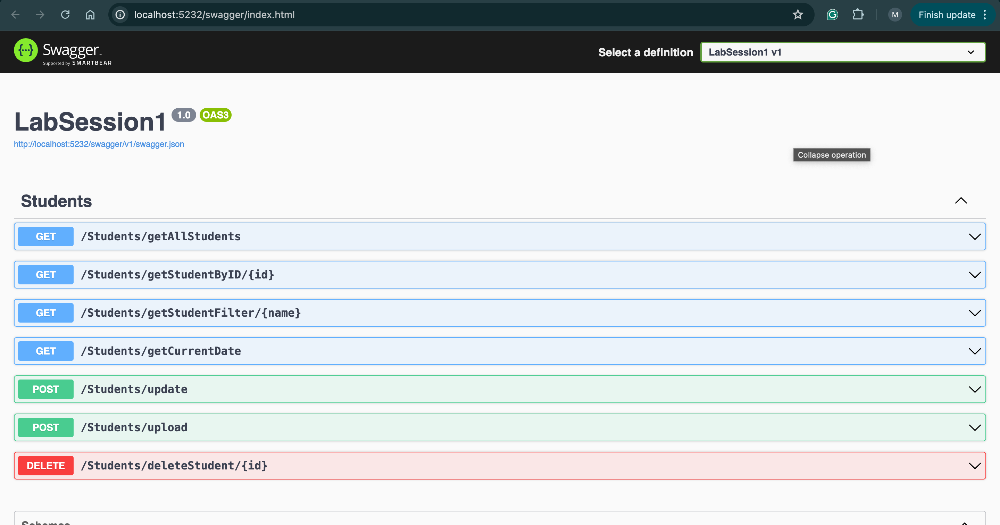

## Step 1
create web api

## Step 2
- class student in the model directory
- add the attributes

## step 3
- create students controller and add a list of students manually

## step 4
- endpoint returns all students getAllStudents

## step 5
- get student by id

## step 6
- filter the students

## step 7
get the current date using CultureInfo method of System.Globalization and by getting the accept-language from the header

## step 8
using the body having the id and name we update the student with the specified ID

## step 9
upload an image: created an image model that takes IFormFile file as argument and a name, and added it as parameter in the upload endpoint

## step 10 
delete student from list

## input validation 
- add required field in the student model

## exception handling
- edit each endpoint the student controller

## dependency injection
- created IStudentService interface
- implemented StudentService class that extends IStudentService interface
- injected it in the Student controller by defining a IStudentService instance and a constructor
then used it in each endpoint to call the function created in the StudentService

- in the Program.cs file -> we should register the service by adding this line
  builder.Services.AddScoped<IStudentService, StudentService>();
- i chose scoped type because it is user specific scope, instances will be created 
once per user and be shared across all the requests.
