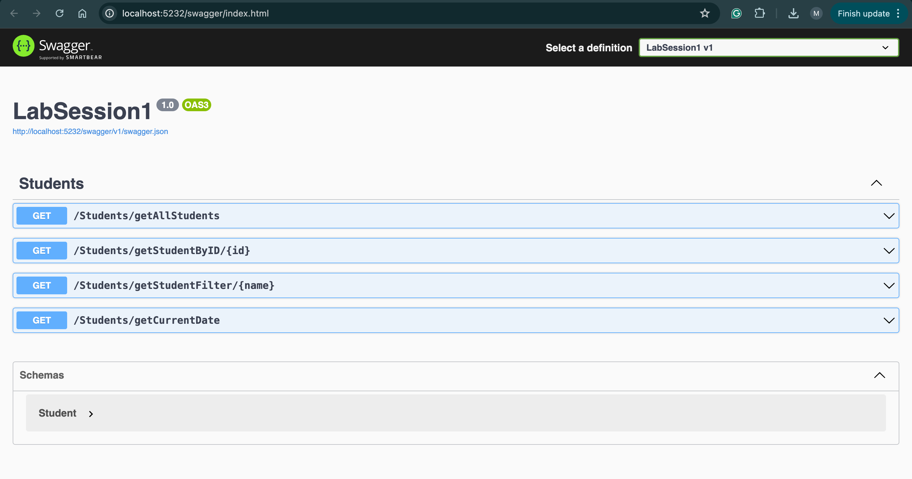

## Step 1
create web api

## Step 2
- class student in the model directory
- add the attributes

## step 3
- create students controller and add a list of students manually

## step 4
- endpoint returns all students getAllStudents

## step 5
- get student by id

## step 6
- filter the students

## step 7
get the current date using CultureInfo method of System.Globalization and by getting the accept-language from the header

## step 8
using the body having the id and name we update the student with the specified ID

## step 9
upload an image

## step 10 
delete student from list

